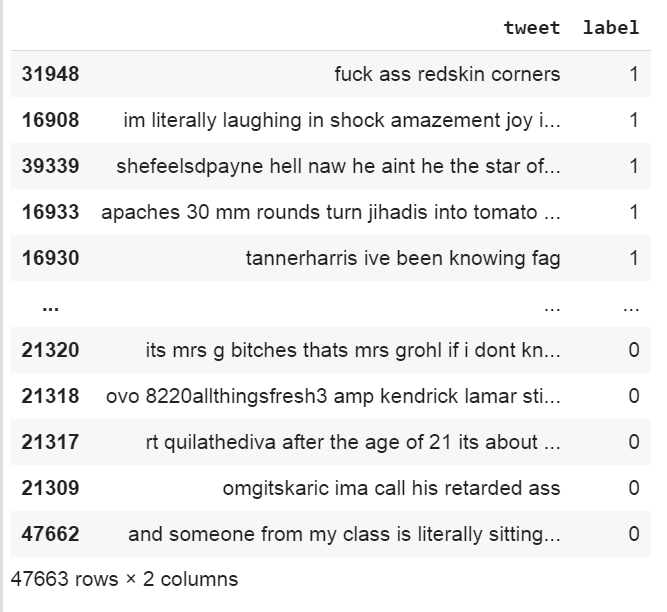

# Discord Hate Speech Detection Bot

A hate speech detection bot for Discord. Uses an LSTM (Long Short-Term Memory Recurrent Neural Network) with 3 densely-connected layers trained on Twitter tweets to detect hate speech. Programming language used is Python. Tweet data from various sources; see [./data/](./data/). However a bulk of the data comes from [T-Davidson](https://github.com/t-davidson/hate-speech-and-offensive-language). (Be warned that if you do read through the data, that it contains highly offensive hate speech language including racism, sexism, homophobia, etc.).

## Definition of Hate speech
“speech that attacks, threatens, or insults a person or group on the basis of national origin, ethnicity, color, religion, gender, gender identity, sexual orientation, or disability.” [dictionary.com](http://dictionary.com)

## Examples

## The Dataset

- Incorported the dataset from T-Davidson, et al., paper “Automated Hate Speech Detection and the Problem of Offensive Language” (2017) with some additions from the Analytics Vidhya (2018) data set and some hand-classified by us.

- Data set was pre-processed to convert all text to lowercase, remove punctuation, and pad tweets. A stemmer was used to reduce words to their word stems.

- Hate speech tweets were duplicated to create a data set closer to 50% hate-speech, 50% not-hate-speech tweets. Prior to doing this, the data set was very unbalanced in favor of not-hate-speech examples, and the network would guess not-hate-speech for nearly all test examples, even hate speech ones. Increasing the percentage of hate speech tweets to closer to 50% worked in getting the network to start predicting hate speech examples more accurately. Of course, duplicating examples is not ideal because it can lead to overfitting, however this was the best solution we could come up with given time constraints and a severe lack of good data to use. 

- Tweets were labeled as hate speech only if they constituted actual hate speech; tweets that were merely offensive were not enough to be labeled as hate speech.

- The network was evaluated based on its accuracy to classify input as hate speech or not hate speech.

### Architecture

Which incorporates:
- LSTM 
- NVIDIA's CUDA Deep Neural Network library (cuDNN) for GPU acceleration
- Batch Normalization
- TensorFlow sequencer encoding
- 25 epochs
- Batch size of 128
- 16 word input length
- The 50-50 composite data set
- Right padding on the inputs
- 3 densely-connected layers

### Example Inputs (hate speech words have been blurred)

## Differentiating between non-hate speech words pertaining to a group vs hate speech words pertaining to a group (with hate speech slur blurred):

## Previous Architectural and Design Iterations:

- Stanford GloVe word embeddings
- CNN + LSTM
- Series of deep layers (without CNN or LSTM)
- 33 and 64 word inputs
- Batch size of 32
- Left side padding on tweets
- 1, 2, 50, and 100 epochs

We tried many different types of architecture: CNN, RNN, CNN with LSTM, a series of dense layers. We tried GloVe embeddings. We tried one-hot encoding vs a tokenizer.

## Design Challenges:
 - Differentiating between text that is hate speech and text that is merely offensive but not hate speech is quite a challenge, as there is a lot of overlap between the two and the differences are very subtle. They can share similar vocabulary.
 
- Text that pertains to race or sex has a higher likelihood of being interpreted as racist/sexist even if it isn’t (false positives), as racist/sexist text shares a lot of the same vocabulary with text that merely pertains to race or sex but isn’t racist/sexist. This is even further complicated by how some hate speech slurs are co-opted or reclaimed by members of a particular group as terms of endearment for fellow members of that group, sometimes with very slight spelling changes, and other times with no spelling changes at all. Trying to get a classifier to perfectly psychicily predict human intent behind word choice is expecting the possible, as even humans cannot do this perfectly.

- The classifier trained on Tweets doesn’t transfer perfectly 1:1 to classifying Discord messages. Tweets are very short (around 200 characters or less), whereas Discord messages can be upwards of 2000 characters. Tweets also contain frequent @mentions to other twitter users as well as hashtags and emojis. These are all far less common in Discord messages, especially @mentions and hashtags. Another interesting thing to note is that the language used in Discord can differ from Twitter also because Twitter is a public platform, whereas Discord is a private one.

 
## Proposal Document

- LaTeX and PDF documents in folder [./proposal/](./proposal/)

## Final Report:

- LaTeX document titled "main.tex" in [./report/](./report/)
