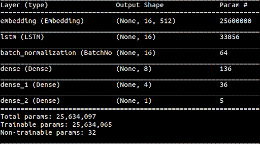
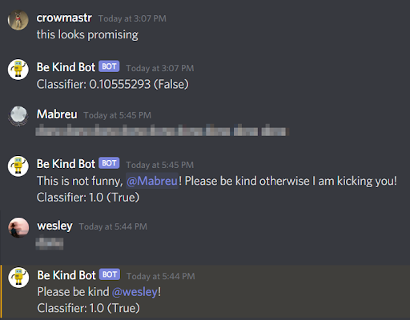
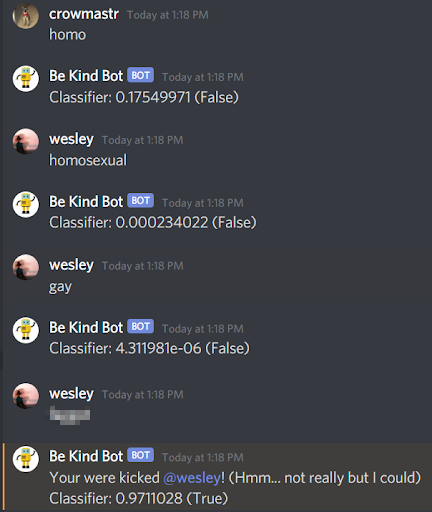

# Discord Hate Speech Detection Bot

A hate speech detection bot for Discord. Uses an LSTM (Long Short-Term Memory Recurrent Neural Network) with 3 densely-connected layers trained on Twitter tweets to detect hate speech. Programming language used is Python. Tweet data from various sources; see [./data/](./data/). However a bulk of the data comes from [T-Davidson](https://github.com/t-davidson/hate-speech-and-offensive-language). (Be warned that if you do read through the data, that it contains highly offensive hate speech language including racism, sexism, homophobia, etc.).

## Definition of Hate speech
“speech that attacks, threatens, or insults a person or group on the basis of national origin, ethnicity, color, religion, gender, gender identity, sexual orientation, or disability.” [dictionary.com](http://dictionary.com)

## Examples
### Architecture

Which incorporates:
- LSTM 
- NVIDIA's CUDA Deep Neural Network library (cuDNN) for GPU acceleration
- Batch Normalization
- TensorFlow sequencer encoding
- 25 epochs
- Batch size of 128
- 16 word input length
- The 50-50 composite data set
- Right padding on the inputs
- 3 densely-connected layers

### Example Inputs (hate speech words have been blurred)

## Differentiating between non-hate speech words pertaining to a group vs hate speech words pertaining to a group (with hate speech slur blurred):

 
## Proposal Document

- LaTeX and PDF documents in folder [./proposal/](./proposal/)

## Final Report:

- LaTeX document titled "main.tex" in [./report/](./report/)
